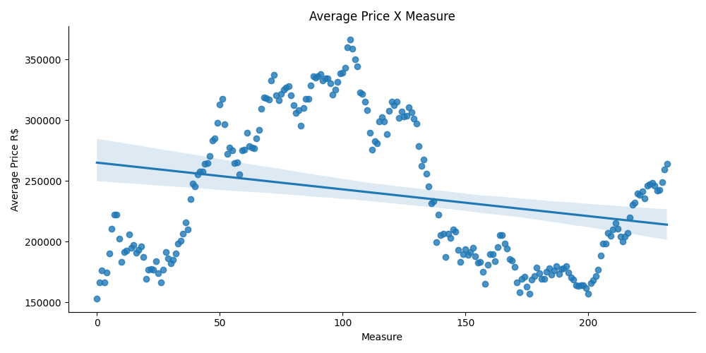
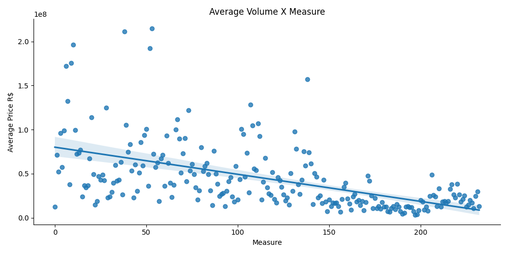
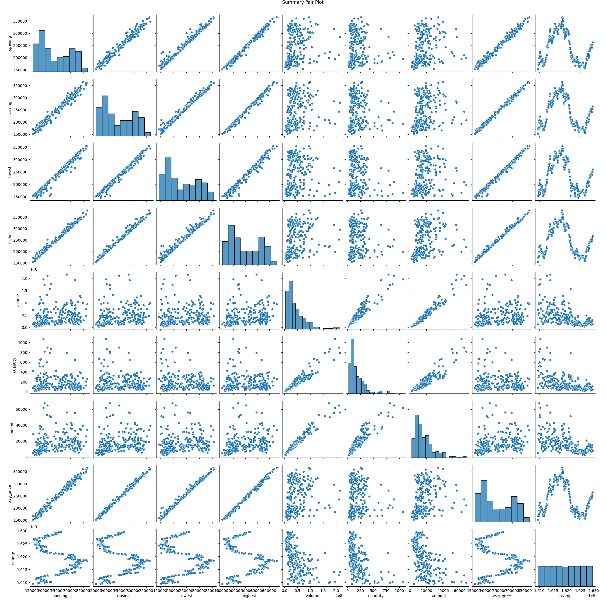
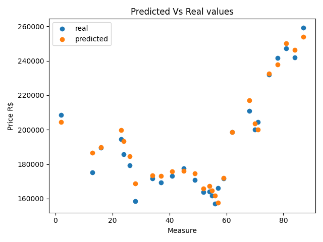
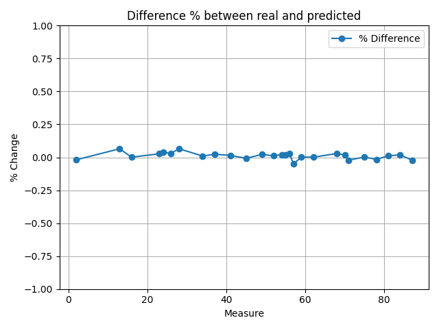

# Mercado Bitcoin Utils

## IMPORTANT: DISCLAIMER
It goes without saying that, **specially** since we are dealing with real money, the usage of this package is intended for 
**YOUR OWN RISK**. I'll give absolutely NO GUARANTIES that it won't spend all the money you may have at the same site.
I am using this for my unique understanding of ML algorithms and some proper fun.

## Introduction

This packed is intended to achieve 3 main things:
1. Control of the APIs of the website [Mercado Bitcoin](https://www.mercadobitcoin.com.br/).
2. Basic Machine Learning (ML) analysis and prediction of Bitcoin with public (or private) data from the same site.
3. Learning ground for some ML algorithms.

## Installation

## Configuration
To configure, you need to create a .ini file with the following parameters:

    [MercadoBitcoin]
    BaseUrl = https://www.mercadobitcoin.net
    TapiID = None
    TapiSecret = None
    
    [Log]
    FileStream =  logs/mercadoBTC.log
    Level = DEBUG

And you can either:
1. Create a system variable named MERCADOBTC_CFG_FILE with the path of the ini file, or
2. Create the file named `mercadoBTC.ini` on your current directory you are calling this package

If the configuration file does not exist, it'll assume the default values (the ones on the sample here)

## Basic Usage
The basic usage is basically the same thing of the Mercado Bitcoin TAPI operations, as depicted [here](https://www.mercadobitcoin.com.br/trade-api/). 
There are some caveats tough:
1. Instead of created a `place_buy_order` and `place_sell_order`, I've created a `place_buy_sell_order`, that received an extra parameter `buy` that if set to True, it'll try to buy some coin, if set to False it'll try to sell some coin.
2. The decimal precision is unspecified on the documentation, and upon trying to place some order you can receive the error `Unable to execute TAPI: Valor de *quantity* deve representar um decimal.`, this basically means to dial down the precision.

Here's a complete example that will:
1. Get your current balance
2. Get the last open orders
3. Place an order to buy your **total** balance in bitcoins

    from mercadobtc_utils.trading.common import Operations
    from pprint import pprint
    import time
    import pandas as pd

    op = Operations()
    account_info = op.get_account_info(assets=['brl', 'btc'])
    time.sleep(1)
    order_book = op.list_order_book('BRLBTC')
    balance = account_info['brl']['available']
    bids_df = pd.DataFrame(order_book['orderbook']['bids'])
    bids_df = bids_df.astype({'quantity': float, 'limit_price': float})
    mean_limit_price = bids_df.describe()['limit_price']['mean']
    min_limit_price = bids_df.describe()['limit_price']['min']
    coin_amount = float(balance)/mean_limit_price
    
    str_limit_price = str(min_limit_price).split('.')
    bid_limit_price = float(str_limit_price[0] + '.' + str_limit_price[1][0:3])
    str_coin_amount = str(coin_amount).split('.')
    bid_coin_amount = float(str_coin_amount[0] + '.' + str_coin_amount[1][0:8])
    print('Will place an order of:')
    print(f'- Price : {bid_limit_price}')
    print(f'- Amount: {bid_coin_amount}')
    time.sleep(1)
    data = op.place_buy_sell_order(buy=True, coin_pair='BRLBTC', quantity=bid_coin_amount, limit_price=bid_limit_price, wait=True)
    pprint(data)

The output can be something like this (with the real order id redacted): 

    Will place an order of:
    - Price : 242903.157
    - Amount: 0.00043022
    {'order': {'coin_pair': 'BRLBTC',
             'created_timestamp': '1630463186',
             'executed_price_avg': '0.00000',
             'executed_quantity': '0.00000000',
             'fee': '0.00000000',
             'has_fills': False,
             'limit_price': '242903.15700',
             'operations': [],
             'order_id': xxxxxxxxx,
             'order_type': 1,
             'quantity': '0.00043022',
             'status': 1,
             'updated_timestamp': '1630463186'}}

If you check again on your balance, you'll see an open order:

    from mercadobtc_utils.trading.common import Operations
    from pprint import pprint
    
    op = Operations()
    data = op.get_account_info(assets=['brl', 'btc'])
    pprint(data)

Output:

    {'brl': {'available': '0.24128', 'total': '104.74307'},
     'btc': {'amount_open_orders': 1,
             'available': '0.00000000',
             'total': '0.00000000'}}

## Machine Learning Analysis
One of the nicest features of this tool is to try to predict some information based on both public information and
private information. This is useful if you want to for instance, find the best time/day to buy/sell Bitcoins. Since
I'm doing this basically for learning purposes of ML, do not expect it to be precise, or even make a lot of sense, it 
probably won't.

That being said, this is how you can use it to:
1. Download (or load) and save the data
2. Basic visual analysis
3. Train and predict to find the average price, based on the daily summary

Please note, that both the algorithm used, the tools, analysis and whatever can change and increase over time.

### Download daily summary data
The first thing you need to do, is to download a daily summary data. To this you can either:
1. Configure the start/end date manually
2. Use the default, that's always the last 80 days

    from mercadobtc_utils.analyzer.public import BasicAnalysis
    import datetime as dt

    ba = BasicAnalysis()
    ba.initial_summary_date = dt.date(year=2021, month=1, day=1)
    ba.end_summary_date = dt.date(year=2021, month=7, day=1)
    ba.download_summary_data()

If you want to use the last 90 days:

    from mercadobtc_utils.analyzer.public import BasicAnalysis
    import datetime as dt

    ba = BasicAnalysis()
    ba.download_summary_data()

Once this is complete, you can see the data in a DataFrame:

    import pandas as pd
    pd.set_option('display.max_columns', None)
    pd.set_option('max_colwidth', None)
    pd.set_option('max_rows', None)
    pd.set_option('expand_frame_repr', False)
    print(ba.summary_data.head())
             date       opening       closing        lowest   highest        volume    quantity  amount      avg_price        tstamp
    0  2021-01-01  152700.00002  153458.30000  151539.00000  153975.0  1.258338e+07   82.272658    4824  152947.343461  1.609459e+09
    1  2021-01-02  153458.30000  172189.98445  153457.40000  174174.0  7.128332e+07  428.284413   28668  166439.218558  1.609546e+09
    2  2021-01-03  171600.00005  176877.58000  170301.01084  180000.1  5.242531e+07  297.404910   23269  176275.860313  1.609632e+09
    3  2021-01-04  176877.58000  174170.00000  156558.57000  177980.0  9.582844e+07  574.750288   29728  166730.561396  1.609718e+09
    4  2021-01-05  174200.00000  178595.00000  165000.00000  179996.0  5.749003e+07  329.441860   21777  174507.364050  1.609805e+09

You can also save the summary to a CSV file:
    
    ba.summary_to_csv('big_sample_2021.csv')

And you can load it from a previously saved file:

    ba.read_summary_csv_data('big_sample_2021.csv')

Now, one thing to be aware of, the `download_summary_data()` method has an optional parameter named `concatenate`. If this
is `True`, then it'll concatenate with the value already loaded. Let's say for instance that you:
1. Downloaded the data from 2021-07-01 till 2021-08-01 (always not inclusive)
2. Saved it as 202107.csv
3. Then you can load it with `read_summary_csv_data('202107.csv')`
4. Configure to download only 2021-08-01 till 2021-09-01
5. Download and concatenate with already existing data `download_summary_data(concatenate=True)`

Now, you would have both months 07 and 08 to train, already cleaned up. Neat!

### Basic visual analysis

Once you have the cleaned public summary data, you can make some standard visual analysis:

    from mercadobtc_utils.analyzer.public import BasicAnalysis
    price, volume, pair, df = ba.get_basic_summary_analysis_plots(calculatePairPlot=True)

This will return a DataFrame (df) with the summary Pandas DataFrame `describe()` method, and some Seaborn lmplot graphs of:
* Average price over time
* Average volume over time

If you pass `True` on the `calculate_pair_plot` parameter, it'll also create a Seaborn pair plot.

Sample plots:

And the DataFrame:

    print(df)
             opening        closing         lowest        highest        volume     quantity        amount      avg_price        tstamp
    count     233.000000     233.000000     233.000000     233.000000  2.330000e+02   233.000000    233.000000     233.000000  2.330000e+02
    mean   239564.991548  240016.531985  231182.389065  246940.855911  4.437645e+07   185.581815  17075.965665  239540.940090  1.619482e+09
    std     60356.308771   60083.253958   59842.333839   60852.025344  3.832123e+07   165.564571  11960.989204   60098.557528  5.823834e+06
    min    152700.000020  153458.300000  145384.090110  153975.000000  3.529856e+06    21.490905   2187.000000  152947.343461  1.609459e+09
    25%    184290.960000  185399.019320  177539.000000  192693.430000  1.805162e+07    80.091222   8470.000000  185147.733005  1.614470e+09
    50%    219899.989980  222007.040610  209072.000010  230000.000000  3.255301e+07   126.792953  13784.000000  222441.227241  1.619482e+09
    75%    299680.106990  299680.197690  289000.000000  309000.000000  5.882376e+07   239.302311  21672.000000  298931.007232  1.624493e+09
    max    365818.129990  365818.129990  354971.940000  380000.000000  2.148945e+08  1070.907116  67602.000000  366497.560528  1.629504e+09

### Train and predict
Now that you downloaded the data, and created some plots, let's train and predict something:

    from mercadobtc_utils.analyzer.public import BasicAnalysis
    ba = BasicAnalysis()
    ba.read_summary_csv_data('full_to_date.csv')
    results, predicted_df, predicted_plot, diff_plot = ba.train_summary(resultComparison=True)
    pdf = ba.predict_summary(7)
    print(pdf)
         date  Average Price
    0  2021-08-22  263839.504160
    1  2021-08-23  263958.000386
    2  2021-08-24  264075.306160
    3  2021-08-25  264191.433441
    4  2021-08-26  264306.394070
    5  2021-08-27  264420.199766
    6  2021-08-28  264532.862132

Ok, so what's going on here? We are basically:
1. Reading a previously save summary data: `ba.read_summary_csv_data('full_to_date.csv')`
2. Training and getting some results: `results, predicted_df, predicted_plot, diff_plot = ba.trainSummary(result_comparison=True)`
3. Predicting for 7 days: `pdf = ba.predict_summary(7)`

Regarding the train module, it will **always** output the result dictionary, but the `predicted_df`, `predicted_plot` 
and `diff_plot` will only be created if `result_comparison` is True. There's another option you can pass, `test_size` that
stated the % of random data that will be used to create the prediction result, the default is 30%.

The `results` is a dictionary with:
* MAE: The Mean Absolute Error found
* MSE: The Mean Square Error found
* RMSE: The Root Mean Square Error found
* Score: The model actual score
* Coeff: A Pandas DataFrame with the coefficient information

The plots are to show, in a visual way, the difference between the real value and the predicted value:

The `predicted_df` itself is a simple DataFrame with the predicted Vs Real values:

    print(predicted_df.head())
         opening           real      predicted          diff  pctChange
    28  167597.93803  158382.496611  168683.308725 -10300.812113   0.065038
    70  202999.99473  200178.253094  203729.704704  -3551.451610   0.017741
    68  216466.00000  210920.583482  217060.426050  -6139.842568   0.029110
    84  245999.99000  241872.402016  246297.707860  -4425.305844   0.018296
    87  253676.35000  259305.291478  253896.948620   5408.342859  -0.020857

Up until now, nothing strange and pretty straightforward ML procedures.

Now, it makes sense to understand just what is going on with the data, and how we are training this particular ML algorithm.
We are using as prediction data, **only** the opening value of the day, and with this we try to predict what would be the
actual average price of the same day Bitcoin. Now, since we don't (yet maybe?) have a method to predict the opening balance,
if you want only 1 day, the model is pretty solid (for now at least, cryptocurrencies values are kinda crazy). However, the
problem arises when you try to predict more than 1 day, since you don't have the opening value of the extra days.

One way to (kinda?) circumvent this, is to use the average predicted price as the opening balance. This can be a little 
reliable, but since usually the average price is almost always lower than the opening value, this can lead to a misinformation
that the average price is lowering, when it should actually be increasing, for this, I've added a control parameter named `useStd`.
Please note that I currently **do not** have the statistical knowledge to vouch for this, but what I thought of was to add
or remove a % of the Standard Deviation on the predicted average price as an input for the next prediction. The decision
to add or remove is taken based on the mean average price of the difference of the last 3 known real measures. This is 
the place that there's more room for improvement, and that will change very soon. For now, it is showing good empirical 
results with the price fluctuations of 2021/08.

    pdf = ba.predict_summary(7, add_std=True)
    print(pdf)
             date  Average Price
    0  2021-08-22  263839.504160
    1  2021-08-23  265388.924746
    2  2021-08-24  266922.779342
    3  2021-08-25  268441.224330
    4  2021-08-26  269944.414520
    5  2021-08-27  271432.503166
    6  2021-08-28  272905.641983

Even so, I wouldn't use this for predicting more than 2-3 days. You can also control the % amount usage of the std with
the `pct_std_usage` parameter.